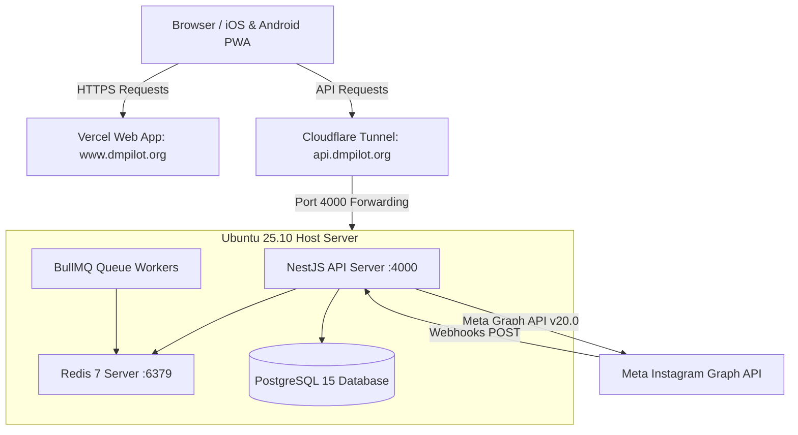
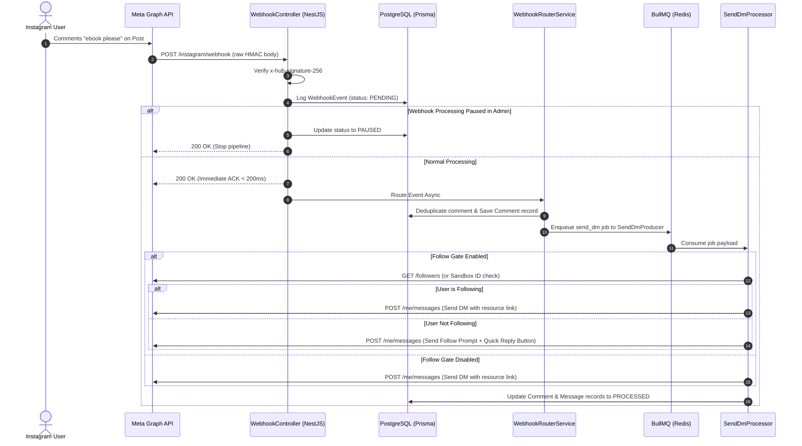

# System Architecture Document — AutoDM (Instagram Business OS)

## 1. System High-Level Topology & Production Hosting

AutoDM is deployed on a hybrid cloud/on-prem infrastructure:



---

## 2. Meta Development Mode & Permission Diagnostics

In **Meta Development Mode** and OAuth scope configuration, Meta Graph API enforces strict privacy and permission boundaries:

### A. Meta Error (#200): Development Mode Tester Restrictions

- **Root Cause**: Before Meta App Review approval for `instagram_manage_messages`, Meta Graph API **ONLY** allows sending DMs and receiving webhooks for Instagram/Facebook accounts explicitly registered as **Developers, Admins, or Testers** in the Meta App Dashboard under _App Roles_.
- **Resolution**: Add commenter Instagram handles as **Testers** in Meta Developer Console under App Roles -> Roles, or publish Meta App to Live Mode after App Review approval.

### B. Meta Error (#230): Permission Scope & Access Token Refresh

- **Root Cause**: Meta error `(#230) Requires pages_messaging permission to manage the object` occurs when the Page Access Token associated with the connected Instagram Account lacks the `pages_messaging` or `instagram_manage_messages` scope permission.
- **Resolution**: Disconnect the account in Settings and click **Connect Instagram Account** to re-authenticate via Meta OAuth, making sure all Facebook Page and Instagram Account permission checkboxes are explicitly selected during authorization.

---

## 3. Webhook Audit & Failure Correlation Engine

Every incoming Meta webhook event undergoes real-time trace correlation:

```prisma
model WebhookEvent {
  id           String        @id @default(uuid())
  provider     String        @default("META")
  eventId      String?       @unique
  payload      Json
  status       WebhookStatus @default(PENDING) // PENDING, PROCESSED, FAILED, PAUSED
  errorMessage String?
  commentId    String?
  username     String?
  senderId     String?
  fbtraceId    String?
  createdAt    DateTime      @default(now())
  updatedAt    DateTime      @updatedAt

  @@index([status])
  @@index([createdAt])
  @@index([commentId])
  @@index([fbtraceId])
}
```

### Audit Log Features & Scoping Rules

- **User-Scoped Creator Access**: Creator users only view webhooks matching their connected Instagram accounts (`userId` scope).
- **Dedicated Admin Audit Tab**: Dedicated "Webhooks Audit" tab in the Admin Panel (`/admin` -> Webhooks tab) for global system inspection.
- **Live Audit Log Table**: Displays `Time | Comment ID | User | Send Status | Error Diagnostic | fbtrace_id`.
- **Meta `fbtrace_id` Capture**: Captures the unique `x-fb-trace-id` header and JSON `error.fbtrace_id` returned by Meta for direct correlation with Meta Developer Support tickets.
- **Global Webhook Pause Switch**: Enables 1-click system-wide webhook processing pause/resume.
- **Timeframe Purge Controls**: Supports selective log deletion (`All Time`, `Older than 24 hours`, `Older than 7 days`, `Older than 30 days`).
- **Failed Jobs Purge & Refresh**: Supports timeframe purging for failed jobs in BullMQ queues and `QueueJob` database records.

````

### Infrastructure Components:

- **Frontend Hosting (Vercel)**: Serves `https://www.dmpilot.org` directly from Vercel's global edge network. Manages static generation, server-side rendering, NextAuth authentication callbacks, and client-side state.
- **Backend Host (Ubuntu 25.10 Lab PC)**: Runs the NestJS API server on port `4000`, along with PostgreSQL (database) and Redis (queue broker).
- **Cloudflare Tunnel (`cloudflared`)**: Routes inbound HTTPS traffic from `https://api.dmpilot.org` to `localhost:4000` on the Ubuntu lab PC without exposing public ports or requiring a static IP.
- **Meta Graph API & Webhooks**: Inbound webhooks from Instagram/Facebook hit `https://api.dmpilot.org/instagram/webhook` via Cloudflare, reaching the NestJS engine in under 150ms.

---

## 2. Technology Stack & Monorepo Structure

AutoDM is structured as a PNPM Monorepo managed via workspace dependencies:

```text
AutoDM/
├── apps/
│   ├── api/             # NestJS 10 REST API, Prisma ORM, BullMQ Processors
│   └── web/             # Next.js 14 App Router, NextAuth.js, TailwindCSS, Framer Motion
└── packages/
    ├── config/          # Shared ESLint, Prettier, and tsconfig presets
    ├── types/           # Shared TypeScript interfaces (ApiResponse, ApiErrorResponse, UserDto)
    └── ui/              # Monorepo UI library (Button, Dialog, Toaster, Tailwind Preset)
````

### Technology Matrix:

- **Frontend Layer**: Next.js 14 (App Router), React 18, TailwindCSS (vanilla custom design system), Framer Motion, TanStack React Query, NextAuth.js (JWT strategy), Lucide React.
- **Backend Layer**: NestJS 10, TypeScript 5, Passport.js (JWT Strategy), Zod (config validation), Class Validator, Nodemailer / Resend.
- **Database & Persistence**: PostgreSQL 15, Prisma ORM 5 (`prisma-client-js`), Redis 7 (`ioredis`).
- **Queue & Background Processing**: BullMQ 5 (`@nestjs/bullmq`) backed by Redis.
- **Payment Gateway**: Razorpay Node.js SDK (`razorpay.paymentLink.create`).

---

## 3. Dynamic Webhook Event Pipeline

When an Instagram commenter interacts with a post or sends a message, the payload flows asynchronously through the following pipeline:



---

## 4. Complete Database Schema (23 Models)

The system uses PostgreSQL managed via Prisma ORM (`prisma/schema.prisma`):

| Model Name             | Purpose & Description                        | Primary Key / Indexes                                | Key Relations                                                |
| ---------------------- | -------------------------------------------- | ---------------------------------------------------- | ------------------------------------------------------------ |
| **`User`**             | Platform creators and system admins          | `id` (UUID), `@unique(email)`                        | `settings`, `instagramAccounts`, `campaigns`, `subscription` |
| **`Settings`**         | User dashboard preferences (theme, timezone) | `id` (UUID), `@unique(userId)`                       | `user`                                                       |
| **`InstagramAccount`** | Linked Instagram Business channels           | `id` (UUID), `@unique(instagramId)`                  | `user`, `campaigns`, `comments`, `messages`                  |
| **`Campaign`**         | DM & comment automation funnels              | `id` (UUID), `@@index([userId, status])`             | `user`, `instagramAccount`, `keywords`, `posts`              |
| **`Post`**             | Instagram posts attached to a campaign       | `id` (UUID), `@@index([campaignId])`                 | `campaign`                                                   |
| **`Keyword`**          | Trigger phrases for campaign matching        | `id` (UUID), `@@index([campaignId, keyword])`        | `campaign`                                                   |
| **`WebhookEvent`**     | Inbound Meta webhook logs                    | `id` (UUID), `@unique(eventId)`, `@@index([status])` | None                                                         |
| **`Comment`**          | Tracked public post comments                 | `id` (UUID), `@unique(commentId)`                    | `instagramAccount`, `campaign`                               |
| **`Message`**          | Tracked incoming & outgoing DMs              | `id` (UUID), `@unique(messageId)`                    | `instagramAccount`, `campaign`                               |
| **`QueueJob`**         | Internal BullMQ job audit log                | `id` (UUID), `@@index([status, runAt])`              | None                                                         |
| **`ApiLog`**           | HTTP API request/response audit trail        | `id` (UUID), `@@index([userId, statusCode])`         | `user`                                                       |
| **`Notification`**     | User dashboard alerts & system events        | `id` (UUID), `@@index([userId, isRead])`             | `user`                                                       |
| **`AuditLog`**         | Admin & security activity audit trail        | `id` (UUID), `@@index([userId, createdAt])`          | `user`                                                       |
| **`RefreshToken`**     | JWT Refresh Token session persistence        | `id` (UUID), `@unique(token)`                        | `user`                                                       |
| **`Subscription`**     | Billing tier & subscription state            | `id` (UUID), `@unique(userId)`                       | `user`                                                       |
| **`Invoice`**          | Payment transaction receipts                 | `id` (UUID), `@@index([userId])`                     | `user`                                                       |
| **`BillingPlan`**      | Pricing tier limits & metadata               | `id` (UUID), `@unique(key)`                          | None                                                         |
| **`FeatureFlag`**      | System feature toggles per plan              | `id` (UUID), `@unique(key)`                          | None                                                         |
| **`UsageRecord`**      | Monthly usage metrics tracking               | `id` (UUID), `@@unique([userId, metric, period])`    | `user`                                                       |
| **`DeleteRequest`**    | User account deletion requests               | `id` (UUID), `@unique(userId)`                       | `user`                                                       |
| **`SystemSetting`**    | System key-value configurations              | `id` (UUID), `@unique(key)`                          | None                                                         |
| **`SupportTicket`**    | User customer support tickets                | `id` (UUID), `@@index([userId])`                     | `user`                                                       |
| **`FollowerHistory`**  | 30-day daily follower counts for charts      | `id` (UUID), `@@unique([instagramAccountId, date])`  | `instagramAccount`                                           |

---

## 5. Centralized API Client Architecture (`apps/web/lib/api-client.ts`)

All frontend API calls pass through a centralized communication wrapper:

```typescript
// Single Source of Truth for Endpoint Domain
export const API_BASE_URL = process.env.NEXT_PUBLIC_API_URL || 'https://api.dmpilot.org';

// Typed High-Level Client with Envelope Unwrapping & Session Token Injection
export async function apiRequest<T>(path: string, options: RequestInit = {}): Promise<T>;

// Lightweight Authenticated Fetch Helper for Dashboards
export async function fetchWithAuth<T>(path: string, options: RequestInit = {}): Promise<T>;
```

### Key Technical Guarantees:

1. **Automatic Bearer Injection**: Fetches NextAuth session client-side and sets `Authorization: Bearer <accessToken>`.
2. **CORS & Tunnel Headers**: Appends `ngrok-skip-browser-warning` and `Content-Type: application/json` to every request.
3. **Envelope Normalization**: Automatically strips NestJS `{ success: true, data: T }` wrappers to return unwrapped data directly to React components.
4. **Friendly Error Translation**: Intercepts backend database codes and throws human-readable `ApiError` instances.

---

## 6. Token Security & Encryption Architecture

- **Access Token**: Short-lived JWT (15-minute expiration) signed with `JWT_SECRET`. Contains payload `{ sub: userId, email, role }`.
- **Refresh Token**: 64-byte secure random hex string saved in `RefreshToken` table with 30-day expiration. Automatic rotation on `/auth/refresh`.
- **Instagram Access Token Encryption**: AES-256-GCM symmetric encryption for connected Instagram page access tokens using `ENCRYPTION_KEY`. Tokens are stored as `iv:ciphertext:tag` and decrypted only in memory during graph API requests.
- **Password Hashing**: Salted with `bcrypt` (10 rounds).
- **Webhook Signature Verification**: Verifies `x-hub-signature-256` header on incoming Meta raw request bodies using `META_APP_SECRET`.
